# Study Mate App

## 🚀 **Instructions**

### 1️⃣ Clone this repository

```sh
git clone <repository_url>
cd <repository_name>
```

---

## 🔧 **Back End Setup**

### 2️⃣ Install dependencies

```sh
npm install
```

### 3️⃣ Create a `.env` file with the following API keys:

```env
OPENAI_API_KEY=your_openai_key
MONGO_URI=your_mongodb_uri
```

### 4️⃣ Run the server

```sh
npm start
```

---

## 🎨 **Frontend Setup**

### 5️⃣ Replace your IP address in `apolloClient.ts`

If you're running the app with **Expo Go** on mobile, update the **Apollo Client** endpoint with your machine's local IP.

### 6️⃣ Install dependencies

```sh
npm install
```

### 7️⃣ Start the app

```sh
npx expo start
```

---

## 📌 **The Project**

This app allows users to upload a **PDF file (≤10MB)**. The AI then generates a **set of quiz questions and answers**. Additionally, a **set of flashcards** is generated (not displayed in the UI).

Users can:  
✅ Start studying by answering questions and verifying answers.  
✅ Manage their quizzes (max **10 quizzes**) by deleting old ones when needed.

### 🔧 **Back End Tech Stack**

- **Node.js**
- **GraphQL** with **Apollo Server**
- **MongoDB** (for storing quizzes)
- **OpenAI GPT-4o-mini** (for generating quizzes)

## 🎨 **Frontend Tech Stack**

This project is built with:

- **React Native (Expo + TypeScript)**
- **NativeWind (TailwindCSS for styling)**
- **GraphQL Client (Apollo)**

| Screens     |        iOS                  |          Android (dark mode)            |                 Web                               |
| ----------- | :-------------------------: | :-------------------------------------: | :-----------------------------------------------: | 
| Home        |  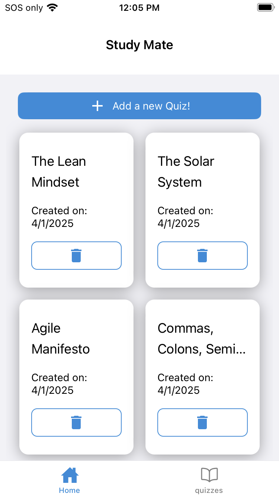  |  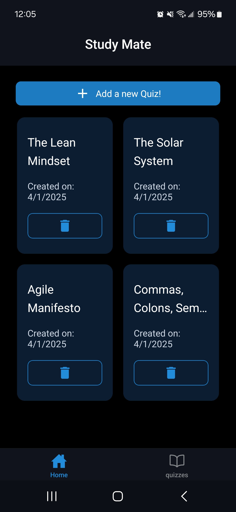   |  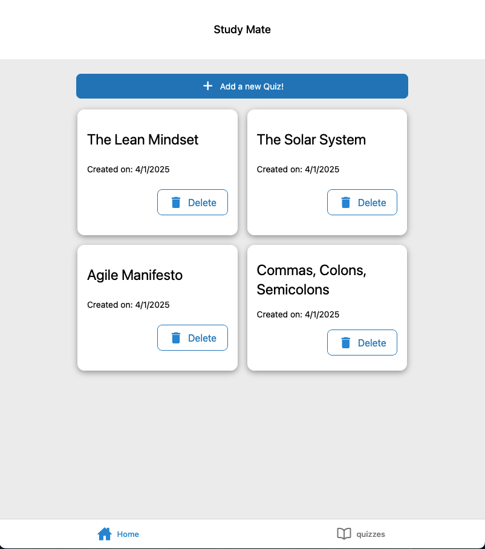   |
| Create Quiz |  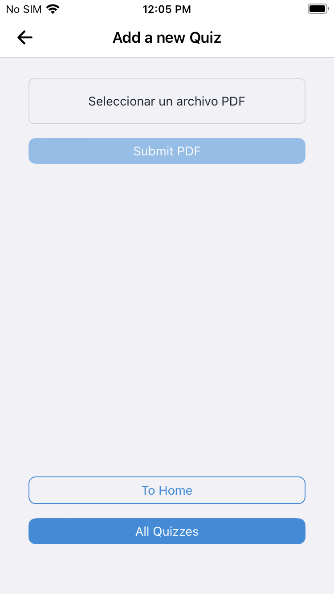   |     | 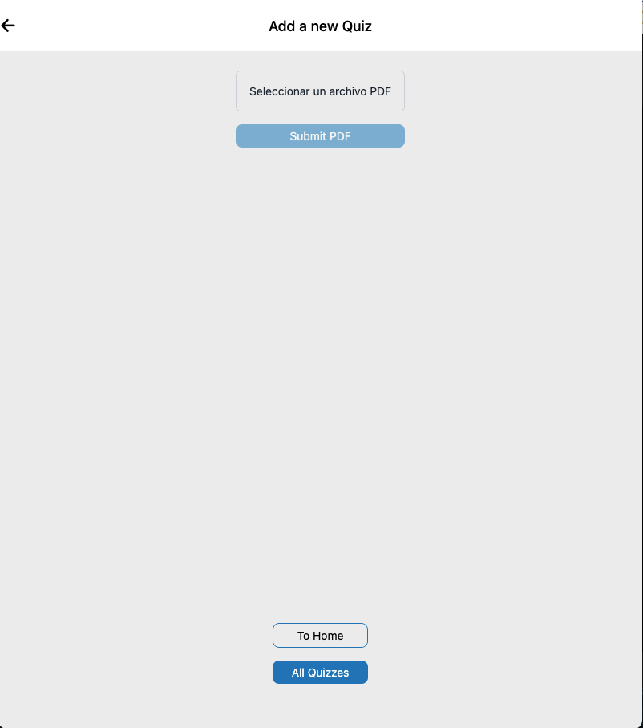    |
| All Quizzes |  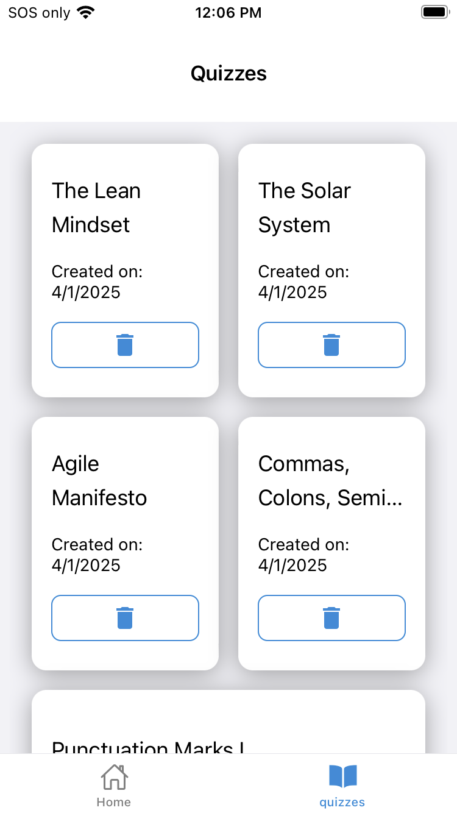   |     |     |
| Quiz        | 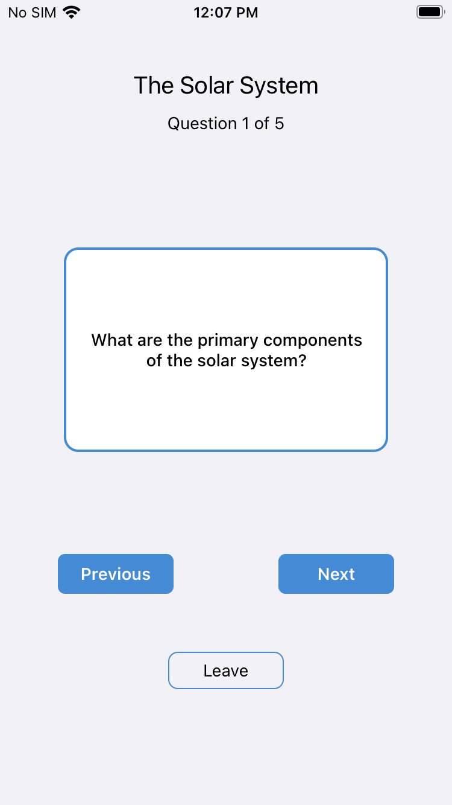 | 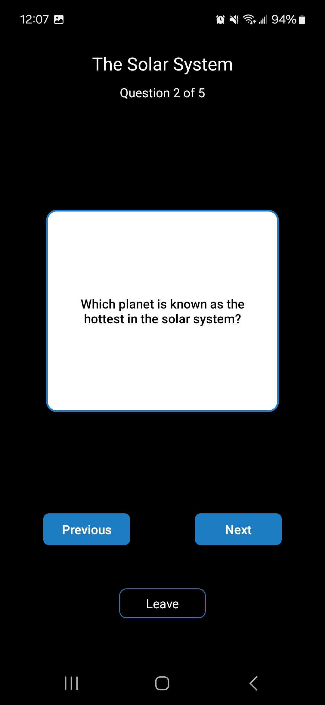 | 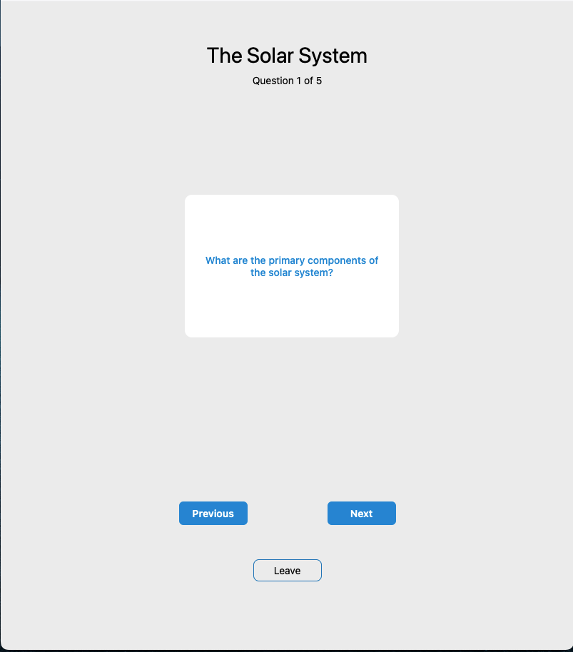 |
|             | 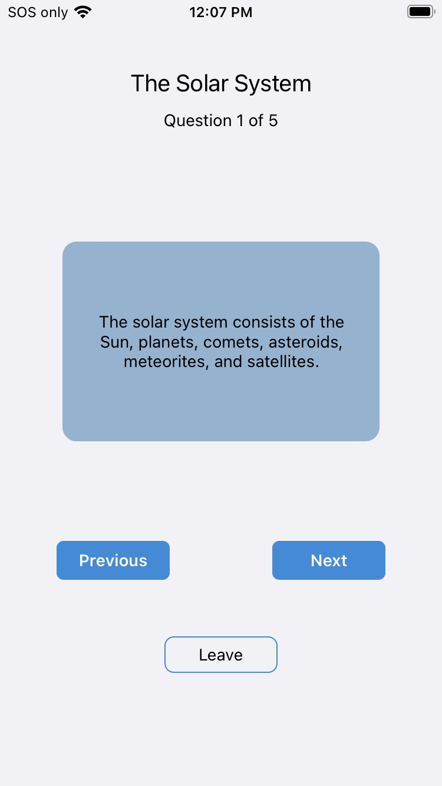 | 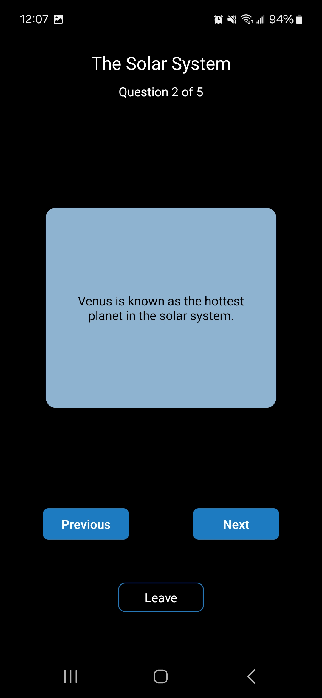 |                                                                             |

---

## 📌 **Conclusions**

- **GraphQL** has significantly simplified querying and data management.
- **React Native** enables seamless development for **iOS, Android, and Web** with a single codebase.

### 🚀 **Future Improvements**

✅ Scale the app for more users.  
✅ Enhance backend security (** for example: user authentication, PDF scanning, and more**).  
✅ Implement **ML-based PDF extraction** for images and other embedded content.  
✅ Allow users to:

- Select the **number of questions** per quiz.
- Customize the **AI prompt** to tailor the quiz generation.
